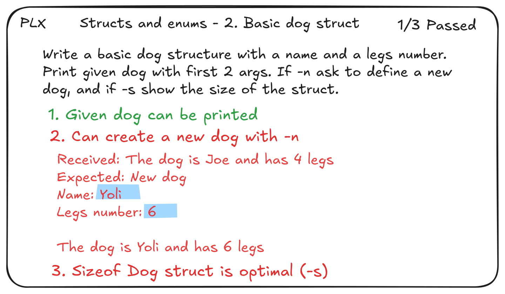
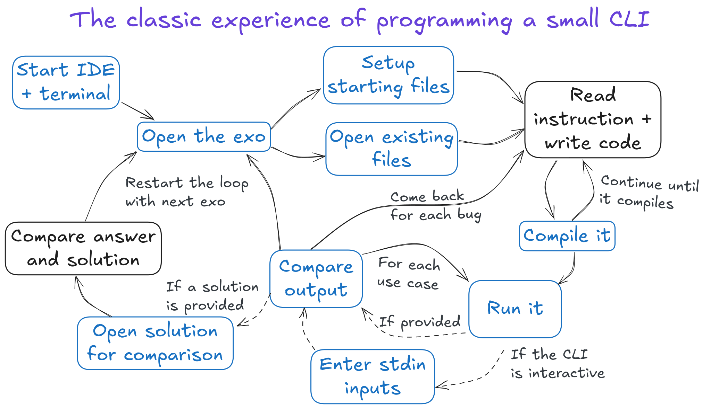

**We recommend to read this page with nice preview on the deployed version on [plx.rs](https://plx.rs)**

## Why
> The classic way of doing programming exercises is full of friction that slows down the progress, and creates distraction from learning. PLX is here to redefine the experience, based on deliberate practice principles, because IT students really deserve it.

#### Practice programming exos in delightful Learning eXperience

Whether you are learning `C`, `C++` or `Java`, PLX can bring you
1. 🔁 **A feedback loop as short as possible**  
The compilation and checks run immediately after file changes, removing the need and time to click the Play button or finding the build command and target file.
1. 💯 **100% focus on the learning tasks**  
Writing code, fixing compilation errors, making checks pass and refactor. All other administrative steps are automated, reducing feedback time and removing some mental overhead !
1. ✅ **Various kind of automated checks and rich results**  
Mentally comparing 20 lines of output with the expected output is a thing of the past! The output should already be diffed to highlight differences in colors.

This is PLX during a small C exo, at the left of the IDE opened on `dog.c`.

## The classic experience
If you are not helped by any tool except your IDE (no existing file, no test, no runner, no watch mode), and your compile+run the exo manually in the terminal, here is the view of the workflow.

All steps (the bubbles) are necessary actions to be done manually by students, the blue ones are those that could be completely/partially automated. 

## The PLX experience
In the same context, running an exo with PLX looks like this: no more blue steps, faster process and almost zero friction!

Here we consider the *Compare output* step to not exist because PLX shows a nice words level diff of the output compared to the expected one, enabling instant understanding of the issue.

## Helping students
As you can imagine PLX can have **a big impact on the speed and the flow of training** on programming problems, finally leading to better and more efficient practice. But it could also help for labs !

Already developed a battleship in command line ? Or any kind of game with user inputs and change of boards ? How can you make sure all scenarios do work ? You can either test it one by one at the end or regularly, but that's boring... What if you could describe your scenarios with expected outputs and inputs to enter to validate the whole game in various situations ?

## Helping teachers
If you are teaching a course related to C, C++ or Java, PLX can help you to
1. ✅ Enhance your exercises by easily adding automated checks
1. 🏗️ Simplify or remove build configurations
1. ⌨️Simplify management of exo files and solutions
1. 📊 Enable general overview and easy review

Want to know more ? See [Experience for teachers](/book/teachers.html) in the docs.

## Course management
We have designed a ...

<!--TODO: continue this after conception-->
<!--todo: small preview of course management solution.-->
