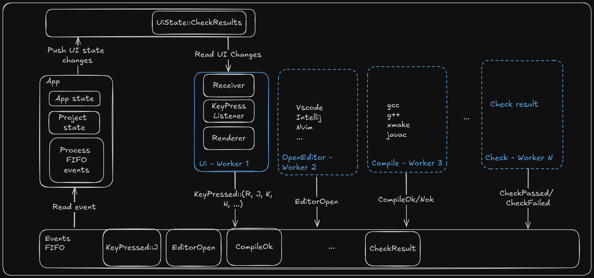

# Architecture

## Running architecture



## File architecture

```sh
.
├── .course-state.toml # save index skill and exo index
├── course.toml # define your course info and skill order
├── pointers
│   ├── crash-debug
│   │   ├── .exo-state.toml # save status of exo
│   │   ├── exo.toml # exo definition
│   │   ├── main.c
│   │   └── main.sol.c
│   ├── crash-debug-java
│   │   ├── .exo-state.toml
│   │   ├── exo.toml
│   │   ├── Main.java
│   │   ├── Main.sol.java
│   │   └── Person.java
│   └── skill.toml # define your skill info and exo order
├── other skills
├── build
   ...
```
