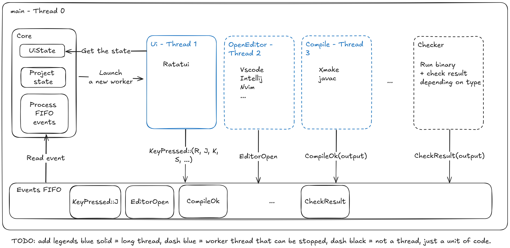

## Planned architecture


## File architecture
```sh
cppexos # exos repository, C++ as example here
	course.toml # define your course info
	skills.toml # define your skills info and order
	structs # first skill
		mega-dog # first exo in this skill
		    exos.toml # exos definition in this skill
		    dog.cpp
	    unit-dog # second exo with unit tests in GoogleTest
		    exos.toml
		    dog.cpp
	pointers # second skill
	    on-functions # first exo in this skill with 3 files
		    exos.toml
		    libparse.c
		    libparse.h
		    main.cpp
	    debug # second exo in this skill with one file
		    exos.toml
		    crash.cpp
```