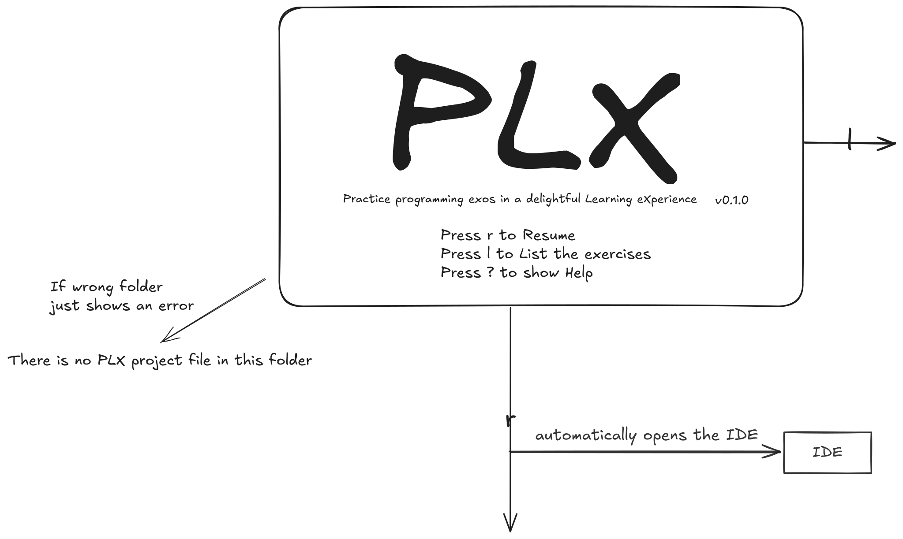
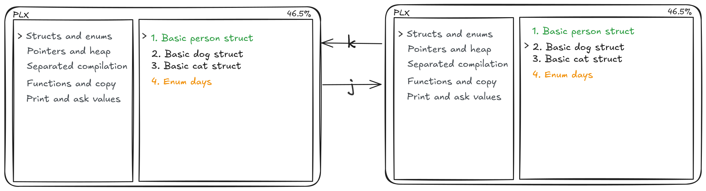
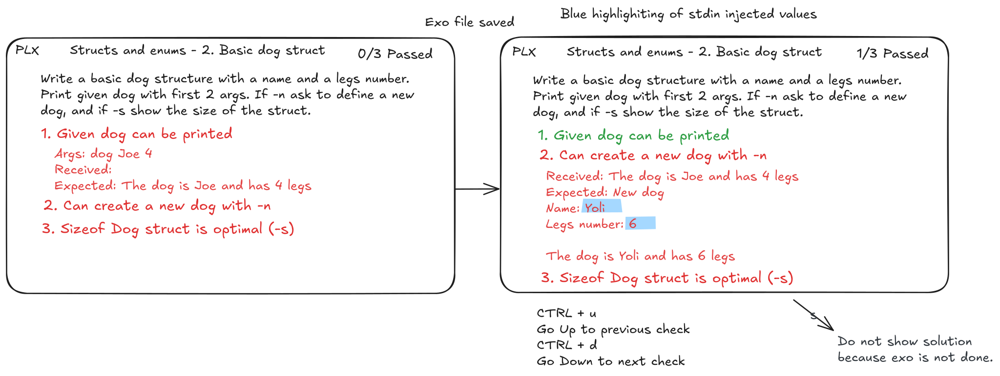
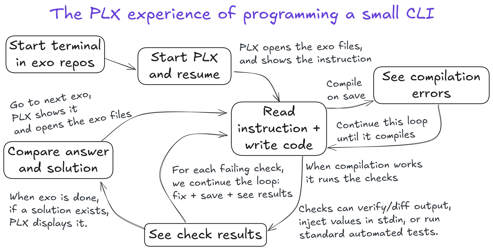

## Mockups
## Case study with the classic experience
Let's consider a typical coding exercise that David needs to resolve:  

---

#### Dog message
Write a small program that displays this message built with the first 2 args. You don't need to check the second arg to be a number.

Example execution:
```sh
> ./dog 
Error: missing argument firstname and legs number
> ./dog Joe 4
The dog is Joe and has 4 legs
```

<details>
<summary>Solution</summary>

```c
#include <stdio.h>

int main(int argc, char **argv) {
  if (argc < 3)
    printf("Error: missing argument firstname and legs number");
  else
    printf("The dog is %s and has %s legs\n", argv[1], argv[2]);
}
```

</details>

---

To solve this exercise, David first read the instruction, then open his IDE, manually create a `main.c` file, copy-paste the starter code, read the existing code and complete the parts that need to be developed. Once he believes the code is ready, David compiles it by opening a terminal in the IDE and typing `gcc dog main.c` — oops! it should have been `gcc -o dog main.c`

```bash
PS C:\Users\david\CLionProjects\dog> gcc dog main.c
c:/program files/mingw64/bin/../lib/gcc/x86_64-w64-mingw32/12.2.0/../../../../x86_64-w64-mingw32/bin/ld.exe: cannot find dog: No such file or directory
collect2.exe: error: ld returned 1 exit status
PS C:\Users\david\CLionProjects\dog> gcc -o dog main.c
PS C:\Users\david\CLionProjects\dog> ./dog Joe 4
The dog is Joe and has legs
```

After this, David input the name and number of legs and compares the output manually to see if it matches the expected result. Opening the instruction again, he realizes that the number of legs is not displayed! He returns to the code, adds the age variable, recompiles, and runs the program again, entering the name and number of legs again. This time, is the output correct? Now David checks his code against the solution... Okay, he could have used `printf` instead of `puts()` twice to display the full name. Moving on to the next exercise, he searches for the instruction, and the cycle repeats...

All these additional steps around writing the code may seem insignificant at first glance, but their accumulation results in considerable friction. Additionally, there will be very few manual executions, meaning limited opportunities to gauge progress and adjust the code accordingly, coupled with the mental burden of compiling and running the program manually.


This workflow resume all different steps that David performs until he finish the exercise.

## Case study with the PLX experience

Let's consider a struct exercise that Alice needs to resolve:  

---

#### 2. Basic dog struct

Write a basic dog structure with a name and legs number. Print given dog with first 2 args. If `-n` ask to define a new dog, and if `-s` show the size of the struct.

<details>
<summary>Solution</summary>

```c
#include <stdio.h>  
#include <stdlib.h>  
#include <string.h>  

typedef struct {  
   const char *firstname;  
   short legs_number;  
} Dog;  

void printDog(Dog *dog) {  
   printf("The dog is %s and has %d legs\n", dog->firstname, dog->legs_number);  
}  
  
int main(int argc, char *argv[]) {  
  
   if (strcmp(argv[1], "-n") == 0) {  
      printf("New dog\nName: ");  
      printf("\nNumber of legs: ");  
      Dog newDog = {.firstname = argv[2], .legs_number = atoi(argv[3])};  
      printDog(&newDog);  
   } else if (strcmp(argv[1], "-s") == 0) {  
      printf("sizeof(Dog): %lu\n", sizeof(Dog));  
   } else {  
      Dog dog = {.firstname = argv[1], .legs_number = atoi(argv[2])};  
      printDog(&dog);  
   }  
}
```

</details>

---
For running PLX, Alice needs to run `plx` in the correct folder that contains the exercises if there is no ".plxproject" file in the given top-level folder the app provides a warning message. 

<!--TODO: Think about the subfolder opening issue. The app will ask again for a folder.-->



Arrows on the picture illustrate the event. This is the home layout of the app PLX. There are three options on this page. First, press `r` to access the last exercise that still needs to be finished. When PLX starts an exercise, it will automatically open the IDE with the correct file and compile the file for the first time. Secondly, press `l` to access the listing of exercises, and lastly press `?` to show the command of the app. So, Alice use PLX for the first time then she press `l` and enter in the list view.


On the list view, there are two columns: 
-  the left one for the list of skills that doesn't change
-  the right side for the list of exercises for the current skill (the list immediately changes when she selects another skill). 
- Press `Enter` to go inside the skill and access the list of exercises and `Esc` to go back.



The meaning of colours for exercises: green = done, orange = one test pass, and default colour = otherwise. To navigate in the list, use `k` for going up and `j` for going down.


Press `Enter` to go to the exercise preview and `Esc` to go back to the exercise list. The preview exercise shows the instruction and the path of the main file, but doesn't run any build in the background to save resources. The preview is not another page, however the `j` and `k` shortcuts will continue to work and the preview will be adapted.



Alice found the exercise she needs to resolve. Her IDE opened the C file corresponding to the exercise. The checks are green when they do not fail and red otherwise. The first failing check is automatically opened. To navigate and see details of the next checks use `Ctrl+d` down and `Ctrl+u` up. When Alice saves the exercise file on the IDE, PLX will automatically run compilation and checks, and update the results of the checks.


Alice makes some changes in is code to resolve check 2 but when she saves is file, PLX run the compilation and give the compilation error.


When all checks are green the exo is done and Alice has the options to press `s` to see the solution. Scrolling inside the solution is with `k` (up) and `j` (down).



This workflow resume all different steps that Alice performs on PLX until she finish the exercise.