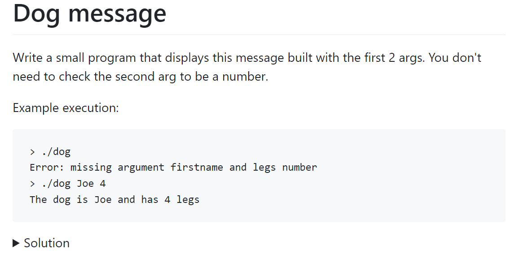
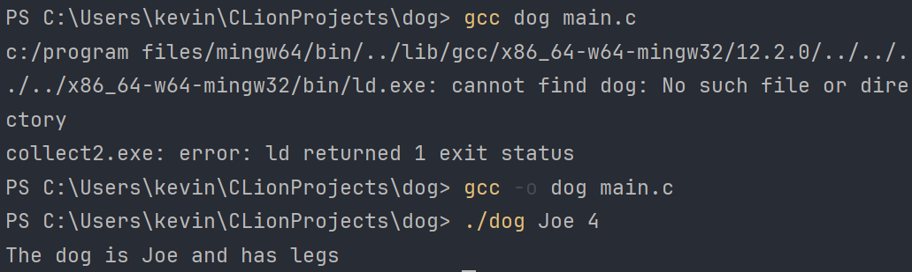

## Project description
TODO: functionnal and non fonctionnal goals

## Architecture
TODO: small schema
TODO: small description

## CI/CD strategy
1. On each PR (and when new commits arrive) and on push on main, `cargo build` and `cargo test` are run to make sure everything is working
1. On each git tag, we will run a CI job to test, build and run `cargo publish` to release PLX on [crates.io](https://crates.io/crates/plx)

todo: document release process
todo: document other OS

## Mockups
### Home page
For running PLX, the user need to run `plx` in the correct folder that contains the exercises if there is not ".plxproject" file in the given top-level folder the app provides a warning messages. 

<!--TODO: Think about the subfolder opening issue. The app will ask again for a folder.-->

Arrows on the picture illustrate the event. This is the home layout of the app PLX. There are three options on this page. First, press `r` to access the last exercise that still needs to be finished. When PLX starts an exercise, it will automatically open the IDE with the correct file and compile the file for the first time. Secondly, press `l` to access the listing of exercises, and lastly press `?` to show the command of the app.

### List page

On the list view, there are two columns: 
1. the left one for the list of subjects that doesn't change
1. the right side for the list of exercises for the current subject (the list immediately change when we select another subject). Press `Enter` to go inside the subject and access the list of exercises and `Esc` to go back.

The meaning of colours for exercises: green = done, orange = one test pass, and default colour = otherwise. To navigate in the list, use `k` for going up and `j` for going down.

Press "ENTER" to go to the exercise preview and "ESC" to go back to the exercise list. The preview exercise shows the instruction and the path of the main file, but doesn't run any build in background to save resources. The preview is not another page, therefor the `j` and `k` shortcuts will continue to work and the preview will be adapted.

### Exercise page

The checks are red when they are not fail and green otherwise. The first failing check is automatically opened. To navigate and see details of the next checks use "Ctrl+d" down and "Ctrl+u" up. When the user saves the exercise file on the IDE, PLX will automatically run compilation and checks, and update the results of the checks.

When all checks are green the exo is done, the user has the options to press "s" to see the solution. Scrolling inside the solution is with "k" (up) and "j" (down).

This is an example of report error of compilation if the user save the file and there is a issue to compile the code.

### Case study without PLX
Let's consider a typical exercise: 

To solve this exercise, we first read the instructions, then open an IDE, manually create a `main.c` file, copy-paste the starter code, read the existing code, and complete the parts that need to be developed. Once we believe the code is ready, we compile it by opening a terminal in the IDE and typing `gcc dog main.c`—oops, it should have been `gcc -o dog main.c`

We then input the name and number of legs, and compare the output manually to see if it matches the expected result. Opening the instructions again, we realize that the number of legs display is missing! We go back to the code, add the age variable, recompile, and re-run the program, entering the name and number of legs once more. This time, is the output correct? Now we check our code against the solution. Okay, we could have used `printf` instead of `puts()` twice to display the full name. Moving on to the next exercise, we search for the instructions, and the cycle repeats...

All these additional steps around writing the code may seem insignificant at first glance, but their accumulation results in considerable friction. Additionally, there will be very few manual executions, meaning limited opportunities to gauge progress and adjust the code accordingly, coupled with the mental burden of compiling and running the program manually.
## Landing page
todo

## Technical choices
todo: why rust
todo: why ratatui ?
todo: why a TUI
todo: why xmake
todo: exos structure and files

## Project management
### GitHub workflow
1. We protect the main branch on the main repository to avoid pushing commits directly without any review. The 2 others repository (website + organisation profile) are not protected for ease of change.
1. For each feature or change:
  1. we create a new issue and assign it to the correct person
  1. create a new branch,
  1. try to follow the conventionnal commits standard for writing commit messages,
  1. when done we send a PR.
  1. The PR is automatically merged only after one review, and trivial changes that do not review can be merged by the PR creator.
  1. Github is configured to block merging if CI jobs are failing.
  1. We try to delete the branch when PR is merged.

### Communication
1. We have a Telegram group to have group calls, discuss and ask for reviews
1. We do 2 small coordination meetings starting between 9:30 and 10:00, and another one around 15:00.

### Versionning
We follow semver (Semantic Versionning), see the specification on [semver.org](https://semver.org). All versions under `1.0.0` are not to be considered stable, breaking changes can appear in the CLI arguments, keyboard shortcuts, file structure, exo syntax, ... internal Rust code is not exposed externally as it is not a library, so we don't have to consider major changes in the code.

### Changelog
We follow the [Keep a Changelog](https://keepachangelog.com) convention, we write users oriented changelog at each release to describe changes in a more accessible way that git log outputs between releases.

### Commits
We try to follow the [Conventionnal commits](https://conventionalcommits.org).

### Testing
TODO
