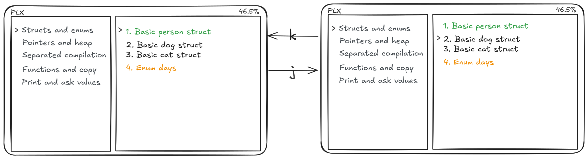
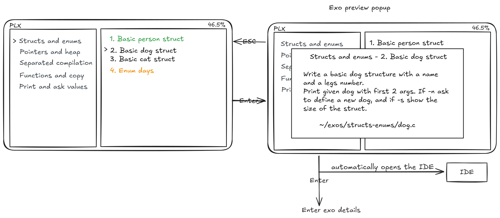
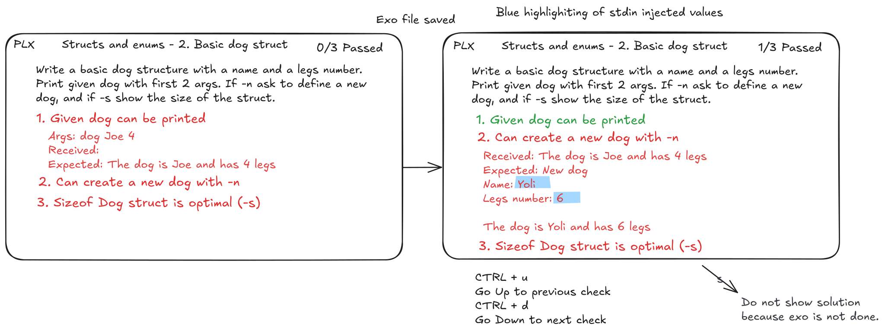
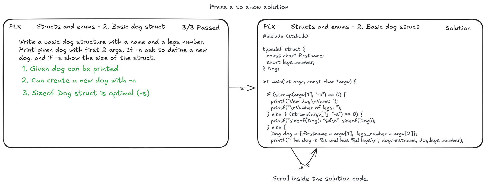
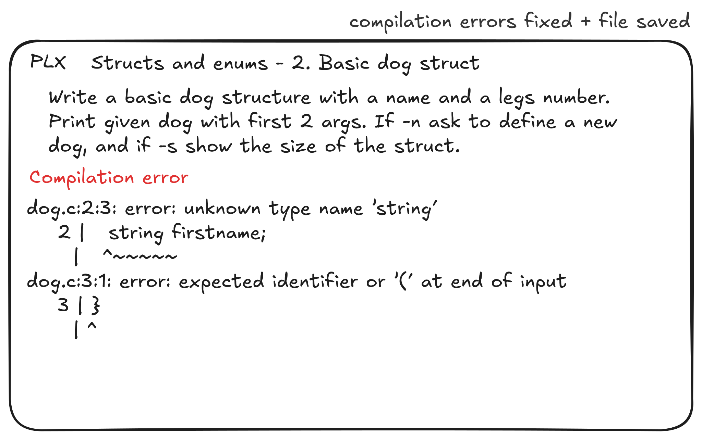

## Project description
TODO: functionnal and non fonctionnal goals

## Architecture
TODO: small schema
TODO: small description

## CI/CD strategy
1. On each PR (and when new commits arrive) and on push on main, `cargo build` and `cargo test` are run to make sure everything is working
1. On each git tag, we will run a CI job to test, build and run `cargo publish` to release PLX on [crates.io](https://crates.io/crates/plx)

todo: document release process
todo: document other OS

## Mockups
### Home page
For running PLX, the user need to choose the folder that contains the exercises if there is not ".plxproject" file in the given top-level folder the app provides a warning messages. The app will ask again for a folder.

Arrows on the picture are to illustrate the event. This is the home layout of the app PLX. There are three options on this page. First, press "r" to access the last exercise work that still needs to be finished. When PLX starts an exercise, it will automatically run the IDE with the correct file and compile the file for the first time. Secondly, press "l" to access the listing of exercises, and lastly press "?" to show the command of the app.
### List page

On the list view, there are two columns the left one for the subject that is fixed and the right side for the exercises that change instead of the chosen subject. Press "ENTER" to go inside the subject and access the list of exercises and "ESC" to go back.

The code colour of exercises is green = done, orange = one test pass, and default colour = otherwise. To navigate in the list, use caps "k" for going up and "j" for going down.

Press "ENTER" to go to the exercise preview and "ESC" to go back to the exercise list. The preview exercise gives the explanation and the path.
### Exercise page

The practising validity tests or points that are red when they are not done and green otherwise. To navigate and see details of the validity points use "CTRL + u" up and "CTRL + d" down. When user save exercise file on the IDE, PLX will automatically update the status of the validity test or points.

When the exercise is done all validity points that are green, the user have the options press "s" to see the solution. Scrolling inside the solution is with caps "k"(up) and "j"(down).

This is an example of report error of compilation if the user save the file and there is a issue to compile the code.
## Landing page
todo

## Technical choices
todo: why rust
todo: why ratatui ?
todo: why a TUI
todo: why xmake
todo: exos structure and files

## Project management
### GitHub workflow
1. We protect the main branch on the main repository to avoid pushing commits directly without any review. The 2 others repository (website + organisation profile) are not protected for ease of change.
1. For each feature or change:
  1. we create a new issue and assign it to the correct person
  1. create a new branch,
  1. try to follow the conventionnal commits standard for writing commit messages,
  1. when done we send a PR.
  1. The PR is automatically merged only after one review, and trivial changes that do not review can be merged by the PR creator.
  1. Github is configured to block merging if CI jobs are failing.
  1. We try to delete the branch when PR is merged.

### Communication
1. We have a Telegram group to have group calls, discuss and ask for reviews
1. We do 2 small coordination meetings starting between 9:30 and 10:00, and another one around 15:00.

### Versionning
We follow semver (Semantic Versionning), see the specification on [semver.org](semver.org). All versions under `1.0.0` are not to be considered stable, breaking changes can appear in the CLI arguments, keyboard shortcuts, file structure, exo syntax, ... internal Rust code is not exposed externally as it is not a library, so we don't have to consider major changes in the code.

### Changelog
We follow the [Keep a Changelog](https://keepachangelog.com) convention, we write users oriented changelog at each release to describe changes in a more accessible way that git log outputs between releases.

### Commits
We try to follow the [Conventionnal commits](conventionnalcommits.com).

todo: check the 3 above links I wrote them by the top of my head...

### Testing
TODO
