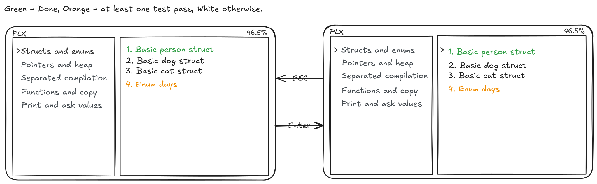

## Project description
TODO: functionnal and non fonctionnal goals

> **P**ractice programming exos in a delightful **L**earning e**X**perience

## Architecture
TODO: small schema
TODO: small description

## CI/CD strategy
1. On each PR (and when new commits arrive) and on push on main, `cargo build` and `cargo test` are run to make sure everything is working
1. On each git tag, we will run a CI job to test, build and run `cargo publish` to release PLX on [crates.io](https://crates.io/crates/plx)

todo: document release process
todo: document other OS

## Mockups
For running PLX, the user need to choose the folder that contains the exercises if there is not ".plxproject" file in the given top-level folder the app provides a warning messages. The app will ask again for a folder.

Arrows on the picture are to illustrate event. This is the home layout of the app PLX. There are three options on this page. First, press "r" to access the last exercise working on that still needs to be finished. When PLX start an exercise, it will run automatically the IDE with the correct file. Secondly, press "l" to access the listing of exercises and lastly press "?" for showing the command of the app.

On the list view, there are two columns the left one for the subject that is fixed and on right side for the exercises that change instead of the choosing subject.

## Landing page
todo

## Technical choices
todo: why rust
todo: why ratatui ?
todo: why a TUI
todo: why xmake
todo: exos structure and files

## Project management
todo

1. We protect the main branch on the main repository to avoid pushing commits directly without any review. The 2 others repository (website + organisation profile) are not protected for ease of change.
1. For each feature or change:
  1. we create a new issue and assign it to the correct person
  1. create a new branch,
  1. try to follow the conventionnal commits standard for writing commit messages,
  1. when done we send a PR.
  1. The PR is automatically merged only after one review, and trivial changes that do not review can be merged by the PR creator.
  1. Github is configured to block merging if CI jobs are failing.
  1. We try to delete the branch when PR is merged.
1. We do 2 small coordination meetings starting between 9:30 and 10:00, and another one around 15:00.

