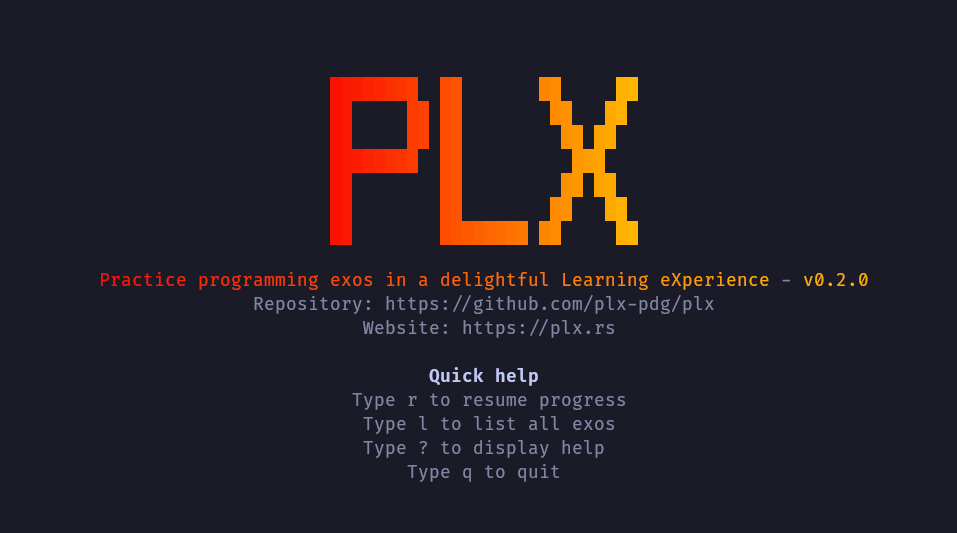
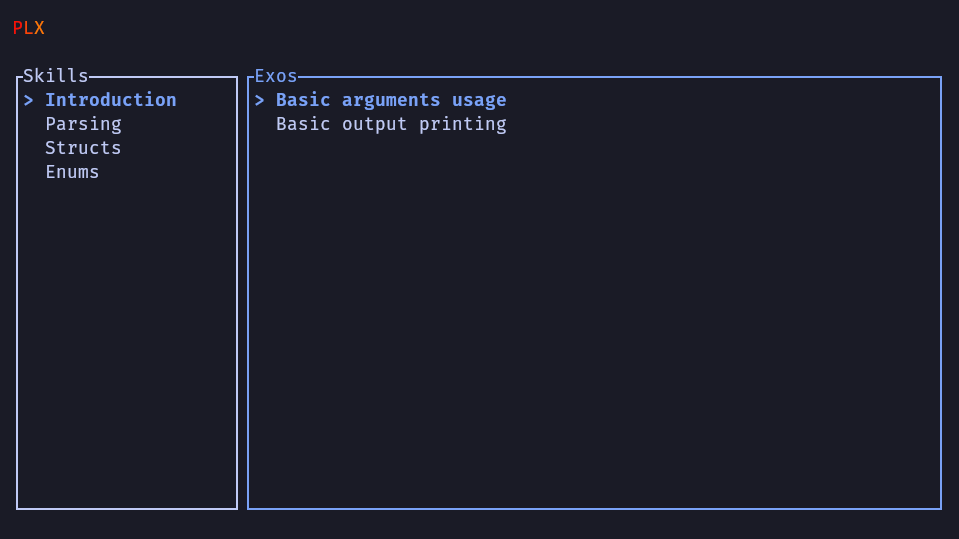
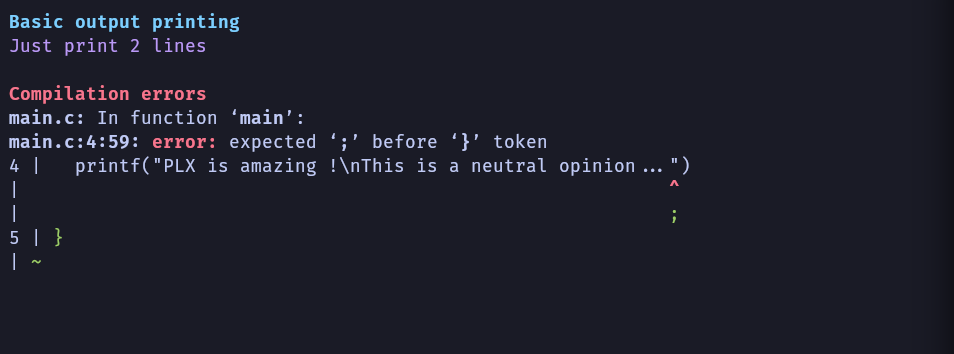
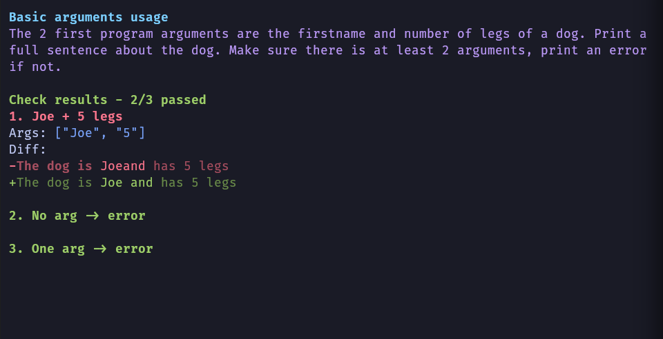

# Project status

These are a few notes about the project status. Everything has been done during PDG (Projet De Groupe) during 3 weeks with a team of 4 IT students. As the landing page doesn't include screenshots and project progression details, I thought having a dedicated page could be useful !

## Demo
Here are few screenshots of the current UIs built into PLX, it is currently possible to do C and C++ exos (without any compilation dependency) with output checks only.

The home page

The list page with list of skills and exos (fictive course for development purpose)

Showing compilation errors with a few manipulations of the output (absolute path like `/home/sam/...../project/exos/main.c` have been replaced with just `main.c`)

Simple output checks to verify basic cases and 2 error cases, with a trivial C program. This is a simple display of an important feature: smart diffing, the possibility to highlight specific words that are changed on a given line and not just indicate red+green lines like Git does.

## Bachelor work
Samuel Roland is going to work on the following big features during ~450 hours during the last semester at HEIG-VD for his bachelor work. This is an amazing opportunity to continue the project with dedicated time !

1. Supporting the [DY syntax](https://delibay.org/docs/use/dy-syntax) (invented for Delibay) in PLX to have a common light and human readable+writable (a.k.a delightful) syntax to define and maintain exos
1. Allowing teachers to see the code and results of students during a live sessions in class, the code is sent to a central server and sent back to the teacher's PLX so there is an opportunity to see the progress, to give global feedback, create interactions around the various approaches...

## Crunch startupper challenge
Samuel is going to participate to the Crunch startupper challenge, the team is still in research. This will allow the project to search and define a potential business model to see if it could be financially sustainable in the long run.

Here the 2 main ideas of business model, around PLX
1. Annual subscriptions for instituations (schools, universities, ...) including
    1. Integrating PLX into existing courses
    1. Coaching teachers to have a deliberate approach to teaching instead of the lecture based approach
    1. Creating exos or transcribe existing ones to PLX formats
    1. Supporting new programming languages or exos types
1. Montly subscriptions for passionnated people
    1. Trainings based on PLX (mix of classic content like video, demos, audio and a lot of exos in PLX directly)
    1. Personal coaching with these people for personal projects they might have, to give the human feedback and continue to improve course content to match the needs.

These ideas are not mature and must be tested/validated with user interviews and other researches... This is why **I'm searching for 2 persons at HEIG-VD doing the Crunch this year to join my team: ideally one person in HEG and another in COMEM :)** If you are interested, please contact me !

## History
1. First development during PDG (Projet De Groupe) during 3 weeks with a team of 4 IT students. TODO: more details.

