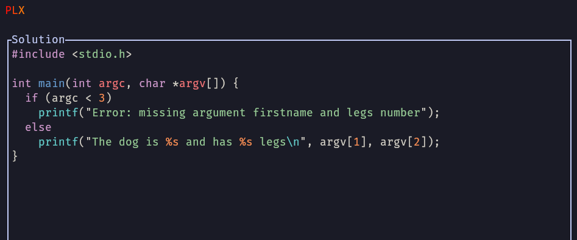

# Project status

These are a few notes about the project status. Everything has been done during PDG (Projet De Groupe) during 3 weeks with a team of 4 IT students. As the landing page doesn't include screenshots and project progression details, I thought having a dedicated page could be useful !

## Demo
Here are few screenshots of the current UIs built into PLX, it is currently possible to do C and C++ exos (without any compilation dependency) with output checks only.

The home page

The list page with list of skills and exos (fictive course for development purpose)

Showing compilation errors with a few manipulations of the output (absolute path like `/home/sam/...../project/exos/main.c` have been replaced with just `main.c`)

Simple output checks to verify basic cases and 2 error cases, with a trivial C program. This is a simple display of an important feature: smart diffing, the possibility to highlight specific words that are changed on a given line and not just indicate red+green lines like Git does.

Once the exo is done (all checks are passing), the solution can be viewed directly in PLX.

**This is only a very first working version of PLX, a lot more has to come. It's very cool to see that only 3 weeks is enough to start feeling this new experience 🔥🔥🔥!** 

## Bachelor work
Samuel is going to work on the following big features during ~450 hours during the last semester at HEIG-VD for his bachelor work (February to July 2025). This is an amazing opportunity to continue the project with dedicated time !

1. Supporting the [DY syntax](https://delibay.org/docs/use/dy-syntax) (invented for Delibay) in PLX to have a common light and delighftul human readable and writable syntax to define and maintain exos
1. Allowing teachers to see the code and results of students during a live sessions in class, the code is sent to a central server and sent back to the teacher's PLX so there is an opportunity to see the progress, to give global feedback, create interactions around the various approaches...

**If you want to see the progress on this work, you can read more in this Git repository: [tb-docs](https://github.com/samuelroland/tb-docs/)**

## MVP course
Samuel is currently participating to the MVP course at HEIG-VD, to explore the challenges of IT and programming teachers to see how to help them.

## Crunch startupper challenge
Samuel has participated with a team of 4 to the Crunch startupper challenge in from 2025-03-17 to 2025-03-21.

## History
1. First development during PDG (Projet De Groupe) during 3 weeks with a team of 4 IT students. TODO: more details.

