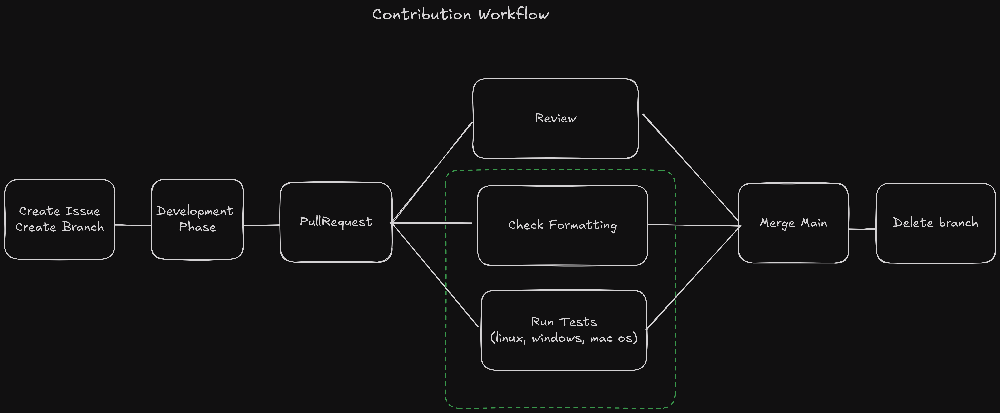

# PLX
<!---->

---

### WHY ?

---

### Architecture

---

### Architecture

---

### Technologies

<v-clicks>
- Rust 
- notify
- ratatui
- serde + toml
- syntect
</v-clicks>

---

### CI - Contributing

---

### CI - Release

---

### Work convention

<v-clicks>
- Versioning: semver 
- Changelog: Keep a Changelog 
- Commits: Conventionnals commits
</v-clicks>

---

### File Architecture

---

### Challenges

<v-clicks>
- Time (support java) 
- Learn Rust as you go
- Windows on CI
</v-clicks>

---

### Landing Page

